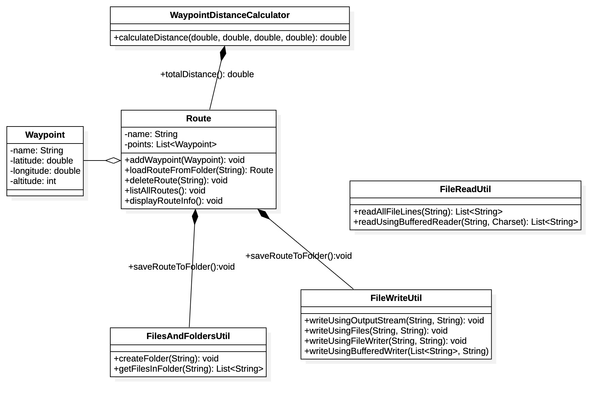

# Lab 8 - Airplane Route Management

## Introduction
An airplane route composed of waypoints is a predefined path through the airspace that an aircraft follows to reach its destination. The route is composed of a series of geographic coordinates called waypoints, which are specific locations in the airspace that are used to define the path of the route. Each waypoint is identified by a unique name and has a specific latitude, longitude, and altitude associated with it.

Airplane routes composed of waypoints can be pre-defined and stored in a flight management system, which is a computerized system used by pilots to plan and execute flights. The flight management system uses the predefined route to guide the aircraft along the path of the route, and can also calculate fuel consumption, estimated time of arrival, and other flight parameters based on the route and current flight conditions.

## Exercise 1

A company needs a route management application that allows users to create and manage routes by specifying waypoints. The application should be able to calculate the total distance of a route, which is defined as the sum of the distances between each consecutive pair of waypoints. Each route should be saved in a separate folder, and each waypoint should be saved as a separate file using serializable mechanism or json format.

Requirements:

The application should allow users to create and delete routes.
- Each route should be associated with a unique name, and the user should be able to specify the name of a new route when creating it. 
- The application should allow users to add waypoints in a route and save to a local folder.
- Each waypoint should have a name, a latitude, a longitude, and an altitude, which the user should be able to specify when creating a new waypoint added to a route.
- The application should calculate the total distance of a route by summing the distances between each consecutive pair of waypoints using the Haversine formula (implementation example https://www.geeksforgeeks.org/haversine-formula-to-find-distance-between-two-points-on-a-sphere/).
- Each route should be saved in a separate folder, and each waypoint should be saved as a separate file using serializable mechanism or json mechanism.
- For simplification each route will be saved in a folder with the same name (as the route)
- The user should be able to load a route from a folder and diplay total distance and list of waypoints
- The user should be able to delete a route (delete a folder content and folder itself containig the route)
- The user should be able to list all available routes (dislay name of the foldeders containing the routes)

For testing you can use this example route:
LRCL-LROP 
- "LRCL" (Cluj-Napoca International Airport): 46.7852° N, 23.6862° E, 415 meters altitude
- "TASOD" (Tasnad VOR/DME): 47.0548° N, 23.9212° E, 10460 meters altitude
- "SOPAV" (Sopot VOR/DME): 46.9804° N, 24.7365° E, 10900 meters altitude
- "BIRGU" (Birligi VOR/DME): 45.9467° N, 26.0217° E, 10200 meters altitude
- "LROP" (Henri Coandă International Airport): 44.5711° N, 26.0858° E, 106 meters altitude

*Notes*
- In project 'examples' package and sub-packages you can find some examples how to work with files, serializable and json. Package workTruckMonitoring contains a litle bit more complex example but you do not need to implement the application in the same way (no need to have repository, service, etc). For this particular case objects are saved as json object but you can use serializable mechanism (see serializableJson and serializableObject exampels);
- In project 'airways' package you can find a sample implementation of function to calculate distance between 2 geographical points; 
- In project 'airways' package you can find a suggested Waypoint object structure which cane be extended in order to fully implement the application;

## Exercise 2 - Use case diagram

Create UML Use-Case diagram for the aplicaiton.

## Exercise 3 - Class diagram

Create UML Class diagram for the aplicaiton.

